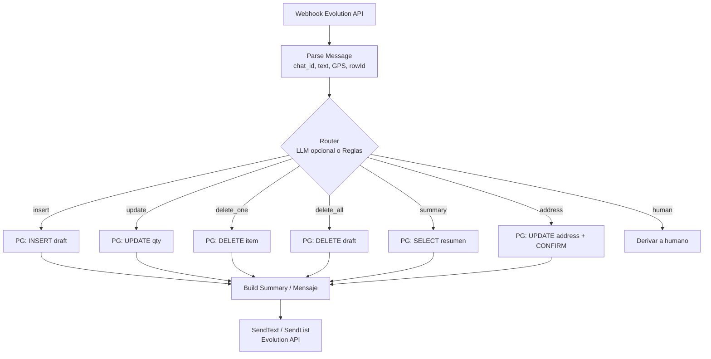

# 🤖 Bot de Pedidos por WhatsApp – Refrigerantes EMAG

Automatización completa de **pedidos mayoristas** (refrigerantes y agua destilada) usando **n8n**, **Postgres**, **Evolution API** y **Docker**.
Este bot replica la lógica de un **carrito de e-commerce** directamente en **WhatsApp**: seleccionar productos, editar cantidades, eliminar ítems, vaciar carrito, ingresar dirección y **confirmar** el pedido.

---

## 📚 Índice técnico

* [Arquitectura](#-arquitectura)
* [Docker Compose (ejemplo)](#-docker-compose-ejemplo)
* [Variables de entorno](#-variables-de-entorno)
* [Flujo del bot (workflow)](#-flujo-del-bot-workflow)
* [Uso rápido](#-uso-rápido)
* [Modo sin LLM (100% determinístico)](#-modo-sin-llm-100-determinístico)
* [Extensiones futuras](#-extensiones-futuras)
* [Licencia](#-licencia)

---

## 📷 Ejemplos visuales

### 🔄 Workflow en n8n

Vista completa del flujo de automatización:


Ejemplo de interacción con Postgres:


---

### 💬 Bot en WhatsApp

Inicio de conversación (mensaje de bienvenida):


Selección de productos con **lista interactiva**:


**LISTA**:


Carrito con **resumen de pedido**:


**LISTA**


Confirmación de pedido con **dirección o ubicación GPS**:


---

## 📦 Lógica del pedido (CRUD)

* **Create (INSERT)**: selecciona producto desde **lista/catálogo** o por texto.
* **Read (READ)**: ver **catálogo** o **resumen** del carrito.
* **Update (UPDATE)**: cambia **cantidad** o **edita** un producto específico.
* **Delete (DELETE)**: **elimina** un ítem o **vacía** todo el carrito.

**Tabla clave:** `orders_draft` con
`id, chat_id, product_code, product_label, quantity, status, address, pending_edit_row`.

---

## ✨ Características principales

* Pedidos por **WhatsApp** (sin apps externas).
* **Catálogo interactivo** (List Messages).
* **Control de carrito**:
  * Agregar productos.
  * **Editar cantidades** (incluye *editar específico*).
  * **Eliminar** productos.
  * **Vaciar** carrito completo.
  * **Reiniciar** carrito (reset por `chat_id`).
* **Confirmación obligatoria con dirección**:
  * Texto libre (ej. “Av. Siempreviva 742”).
  * **GPS** (ej. `-27.3748, -55.9006`).
* **Transferencia a humano** (distribuidor):
  * Automática tras **confirmar dirección**.
  * El cliente puede escribir **volver** o esperar **30 min** para regresar al bot.
* **Borradores persistentes**:
  * Carrito se mantiene aunque el cliente corte la conversación.
* **Resúmenes dinámicos**:
  * Subtotales, total de ítems y total de importe.
* **Lenguaje natural y números**:
  * “Quiero **10** de **amarillo**” / “**diez** de **azul**”.

---

## 🚀 Ventajas competitivas

* Experiencia **simple**: solo WhatsApp.
* Automatización **end-to-end** hasta derivar a un humano.
* **Escalable** y **multiusuario**: cada `chat_id` tiene su borrador.
* Carrito **flexible**: edición y eliminación en cualquier momento.
* Entradas **robustas**: texto y **GPS**.
* **Bajo consumo de IA**:
  * \~**90%** de la lógica es **determinística** (JS + SQL).
  * LLM **solo** para clasificar intención → menor costo/tokens.
* **Extensible**:
  * Conexión a **ERP**, **logística** o **pagos** (Mercado Pago, etc.).

---

## 🛒 Equivalencia con e-commerce clásico

| Función e-commerce  | Función en WhatsApp Bot                          |
| ------------------- | ------------------------------------------------ |
| Carrito (draft)     | Tabla `orders_draft` por `chat_id`               |
| Checkout            | Confirmación con **dirección obligatoria**       |
| CRUD del carrito    | Insert / Read / Update / Delete (n8n + SQL)      |
| Persistencia        | Carrito se mantiene aunque se corte el chat      |
| Atención al cliente | **Derivación a humano** tras confirmar dirección |


---

## 🛠️ Tecnologías y versiones

* **Docker Compose** – orquestación de servicios.
* **Postgres `16`** – almacenamiento de borradores de pedidos.
* **n8n `1.110.1`** – motor de automatización (nodos Code en JS).
* **Evolution API** – gateway de WhatsApp (envío/recepción de mensajes).
* **Node.js** (incluido en n8n) – lógica en JavaScript.
* **LLM opcional (Gemini / OpenAI)** – **solo** como router de intenciones (ahorro de tokens).

> 💡 El bot funciona **sin LLM** (ver [Modo sin LLM](#-modo-sin-llm-100-determinístico)).

---

## 🧱 Arquitectura

* WhatsApp ⟷ **Evolution API** (webhook entrante + endpoints de envío).
* **n8n** recibe el webhook, **parsea** el mensaje y decide acción:
  * `insert`, `update`, `summary`, `address`, `update_specific`, `delete_one`, `delete_all`, `human`.
* **Postgres** persiste el **carrito borrador** (`orders_draft`) por `chat_id`.
* **Respuesta** al cliente con **texto** o **listas** (catálogo) vía Evolution API.

---

## 📂 Docker Compose (ejemplo)

> Ajustá puertos, dominios y credenciales a tu entorno.

```yaml
version: "3.9"

services:
  postgres:
    image: postgres:16
    container_name: pg_emag
    restart: unless-stopped
    environment:
      POSTGRES_DB: ${POSTGRES_DB:-emag}
      POSTGRES_USER: ${POSTGRES_USER:-emag}
      POSTGRES_PASSWORD: ${POSTGRES_PASSWORD:-emag123}
    ports:
      - "5432:5432"
    volumes:
      - pgdata:/var/lib/postgresql/data

  n8n:
    image: n8nio/n8n:1.110.1
    container_name: n8n_emag
    restart: unless-stopped
    depends_on:
      - postgres
    environment:
      N8N_HOST: ${N8N_HOST:-localhost}
      N8N_PORT: 5678
      WEBHOOK_URL: ${WEBHOOK_URL:-http://localhost:5678/}
      DB_TYPE: postgresdb
      DB_POSTGRESDB_HOST: postgres
      DB_POSTGRESDB_PORT: 5432
      DB_POSTGRESDB_DATABASE: ${POSTGRES_DB:-emag}
      DB_POSTGRESDB_USER: ${POSTGRES_USER:-emag}
      DB_POSTGRESDB_PASSWORD: ${POSTGRES_PASSWORD:-emag123}
      TZ: America/Argentina/Buenos_Aires
    ports:
      - "5678:5678"
    volumes:
      - n8ndata:/home/node/.n8n

  evolution-api:
    image: evolutionapi/evolution-api:latest
    container_name: evo_emag
    restart: unless-stopped
    environment:
      # Variables típicas (ajusta a tu proveedor/imagen)
      INSTANCE_NAME: ${EVO_INSTANCE:-emag}
      AUTH_TOKEN: ${EVO_TOKEN:-changeme}
      PORT: 8080
      # ...otras variables según documentación de tu build
    ports:
      - "8080:8080"
    volumes:
      - evodata:/evolution

volumes:
  pgdata:
  n8ndata:
  evodata:
```

---

## 🔑 Variables de entorno

Ejemplo `.env`:

```env
# Postgres
POSTGRES_DB=emag
POSTGRES_USER=emag
POSTGRES_PASSWORD=emag123

# n8n
N8N_HOST=localhost
WEBHOOK_URL=http://localhost:5678/

# Evolution API
EVO_INSTANCE=emag
EVO_TOKEN=poné-un-token-fuerte
```

---

## 🗃️ Esquema de base de datos

```sql
CREATE TABLE IF NOT EXISTS orders_draft (
  id                SERIAL PRIMARY KEY,
  chat_id           TEXT        NOT NULL,
  product_code      TEXT        NOT NULL,
  product_label     TEXT        NOT NULL,
  quantity          INTEGER     NOT NULL CHECK (quantity >= 0),
  status            TEXT        NOT NULL DEFAULT 'draft',     -- draft | with_human 
  address           TEXT,
  pending_edit_row  INTEGER,                                   -- para "editar específico"
  updated_at        TIMESTAMPTZ NOT NULL DEFAULT NOW()
);

CREATE INDEX IF NOT EXISTS idx_orders_draft_chat_status
  ON orders_draft (chat_id, status);
```

**Consultas típicas (n8n → Postgres):**

* **Insert/Update** (UPSERT por fila de carrito):

```sql
INSERT INTO orders_draft (chat_id, product_code, product_label, quantity, status)
VALUES ($1, $2, $3, $4, 'draft')
ON CONFLICT (id) DO NOTHING;
```

* **Resumen de carrito**:

```sql
SELECT product_label, quantity
FROM orders_draft
WHERE chat_id = $1 AND status = 'draft'
ORDER BY updated_at DESC;
```

* **Vaciar carrito**:

```sql
DELETE FROM orders_draft
WHERE chat_id = $1 AND status = 'draft';
```

* **Confirmar con dirección**:

```sql
UPDATE orders_draft
SET status = 'confirmed', address = $2, updated_at = NOW()
WHERE chat_id = $1 AND status = 'draft';
```

> Podés adaptar a UPSERT por `(chat_id, product_code)` si preferís **una fila por producto**.

---

## 🔄 Flujo del bot (workflow)

1. **Webhook Evolution API** → recibe mensajes de WhatsApp.
2. **Parse Message** → extrae:

   * `chat_id`
   * `text`
   * `selectedRowId`, `selectedDescription` (si viene de catálogo/lista)
   * **ubicación GPS**: `latitude`, `longitude` (si el cliente la comparte).
3. **Detect Pedido (router)** → determina acción:

   * `insert`, `update`, `summary`, `address`, `update_specific`, `delete_one`, `delete_all`, `human`.
   * Con LLM: solo **clasificación de intención** (bajo costo).
   * Sin LLM: **regex/keywords** (ver [Modo sin LLM](#-modo-sin-llm-100-determinístico)).
4. **Postgres** → guarda/actualiza en `orders_draft`.
5. **Build Summary** → compone **resumen** con totales (ítems e importe si aplica).
6. **Switch de acciones** → define próximo paso:

   * mostrar **catálogo**
   * **editar cantidad**
   * **eliminar** producto
   * **vaciar carrito**
   * **confirmar** con **dirección** (texto o GPS)
   * transferir a **humano**
7. **SendText / SendList (Evolution API)** → respuesta al cliente.

---

📖 Explicación de los principales códigos
🔹 Parse Message

Normaliza el mensaje entrante para que todo el flujo lo entienda:


🔹 Detect Action

Interpreta acciones de menú/lista:


🔹 Detect Pedido

Determina si el usuario está insertando, actualizando, cerrando o dando dirección:


🔹 Prompt de la IA

El modelo actúa como router, devolviendo SOLO un JSON válido:

{"route": N}

1 → Menú

2 → Catálogo

3 → Humano

4 → Pedido

5 → Acciones avanzadas

🔹 Build Summary

Arma el resumen con totales y dirección:


🔹 Build Draft

Evita que el flujo se rompa cuando el carrito queda vacío:


---

## ⚙️ Instalación

1. **Clonar** este repositorio.

2. Crear archivo **`.env`** (ver [Variables](#-variables-de-entorno)).

3. Levantar servicios:

   ```bash
   docker compose up -d
   ```

4. Abrir **n8n** (`http://localhost:5678/`) e **importar** el workflow:
   `My workflow 2 (19).json`.

5. Configurar el **webhook** de Evolution API → URL pública de n8n.

---

## 🚦 Uso rápido

* Escribir “**catálogo**” para ver productos.
* Enviar “**agregar amarillo 3**” para sumar 3 unidades del producto “amarillo”.
* Enviar “**resumen**” para ver el carrito actual.
* Enviar “**vaciar**” para limpiar el carrito.
* Enviar **dirección** (texto) o **compartir ubicación** (GPS) para **confirmar**.
* Para hablar con un **humano**, escribir “**humano**”.

> El router detecta **intención** y ejecuta la acción correspondiente.

---

## 🧠 Modo sin LLM (100% determinístico)

Si preferís **0 IA**, activá un **router por reglas** (regex/keywords):

* `^catalogo|catálogo|lista` → `read_catalog`
* `^resumen|carrito` → `summary`
* `^vaciar|vacío|vaciar carrito` → `delete_all`
* `^agregar\s+(\w+)\s+(\d+)` → `insert`
* `^editar\s+(\w+)\s+(\d+)` → `update_specific`
* `^eliminar\s+(\w+)` → `delete_one`
* `^(ubicacion|dirección|direccion)` + datos → `address`
* `^humano|asesor` → `human`

Con esto, **no** necesitás LLM y evitás **costo/tokens**.

---

## 📚 Extensiones futuras

* **Pagos automáticos** (ej. confirmación con link de pago).
* **Validación de stock** en tiempo real.
* **Historial** de pedidos por cliente.
* **Panel admin** para distribuidores (resúmenes, asignaciones, estados).

---

## 🗺️ Workflow visual


## 📝 Licencia

Este proyecto se distribuye bajo licencia **MIT**.
© Refrigerantes **EMAG**.
